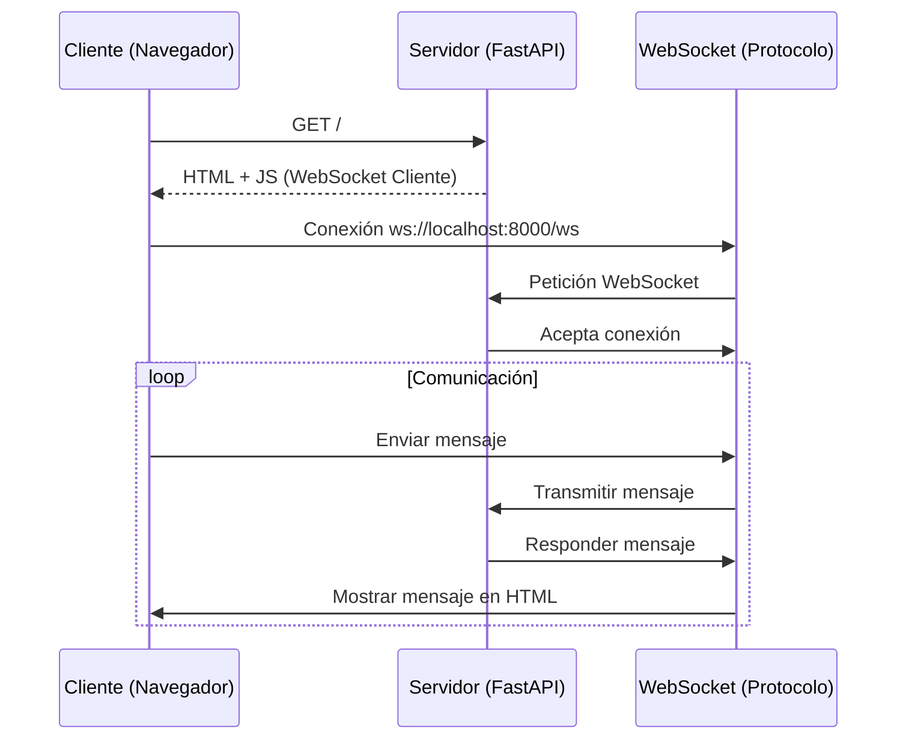

```mermaid
%% archivo: websocket_chat_diagram.mmd
sequenceDiagram
    participant Cliente as Cliente (Navegador)
    participant Servidor as Servidor (FastAPI)
    participant WebSocket as WebSocket (Protocolo)
    
    Cliente->>Servidor: GET /
    Servidor-->>Cliente: HTML + JS (WebSocket Cliente)
    
    Cliente->>WebSocket: Conexión ws://localhost:8000/ws
    WebSocket->>Servidor: Petición WebSocket
    Servidor->>WebSocket: Acepta conexión
    
    loop Comunicación
        Cliente->>WebSocket: Enviar mensaje
        WebSocket->>Servidor: Transmitir mensaje
        Servidor->>WebSocket: Responder mensaje
        WebSocket->>Cliente: Mostrar mensaje en HTML
    end
```

  

   